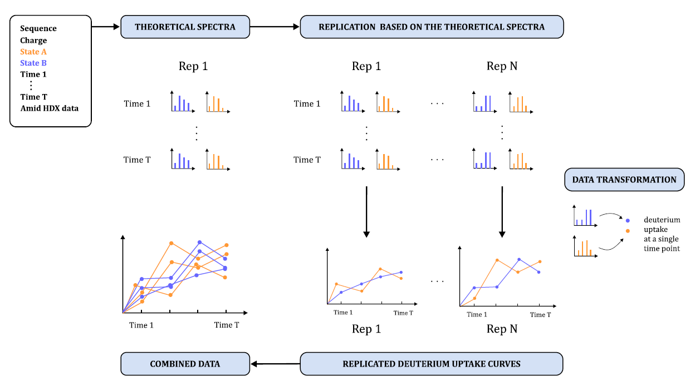
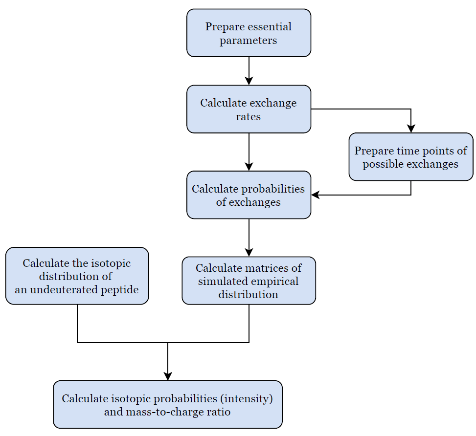

```{r, include = FALSE}
knitr::opts_chunk$set(
  collapse = TRUE,
  comment = "#>"
)
```

```{r setup}
library(powerHaDeX)
```


The package `powerHaDeX` is a tool providing a solution for the need for simulation and analysis of the data coming from HDX-MS experiments. This article is dedicated to the detailed description of the simulation of HDX-MS data. 


# Diagram of HDX-MS curve simulation.

The simulation was created in such a way that it imitates the real experiment as much as it is possible. To obtain the deuterium uptake at a single time point, one has to compute a mass spectrum first. Thus, the simulation consists of two main parts. The first one concerns the biological section of calculations, that is simulation of theoretical spectra, and the second concerns calculating deuteration curves and multiplying the data for the need for power simulation.

1. Simulate theoretical spectrum
2. Add noise to the theoretical spectrum
    - Making replicated theoretical spectra
    - Calculating deuterium uptake curves from replicated spectra
    - Making replicated deuterium uptake curves (power estimation)


The diagram of the simulation algorithm can be seen in the figure below:

<center>
{width=600px}
</center>


The parameters sequence, charge, state, and time point define, simplistically, a unique mass spectrum. Thus, as shown in the above figure, having two different biological states and $T$ different exposure times we obtain $(2 \times T)$ unique spectra. From now on such a set will identify one **replication**. This part of the simulation is described in detail in the section **Simulate theoretical spectrum**. The next step of the simulation is reproducing the number of replications. First, we add noise to the obtained spectra and transform each of them into deuterium uptake. The deuterium uptake at different time points forms the deuterium uptake curve. The set of replicated deuterium uptake curves for different states is the target of the simulation. The procedure is described in **Add noise to the theoretical spectrum**.


## 1. Simulate theoretical spectrum

The algorithm that is used to simulate theoretical spectra is based on Zhong-Yuan Kan's implementation in MATLAB. The original version of codes is located in the repository [HX-MS-Simulations](https://github.com/kanzy/HX-MS-Simulations) (as at 29.06.2020). In the `powerHaDeX` package can be found the Kan's algorithm re-implemented in R (using Rcpp) and the accelerated implementation (that uses Markov chains' properties). Moreover, the package `powerHaDeX` allows the user to simulate spectra for more than one exposure time for both (Rcpp and Markov) approaches.

### Elements of the code

The simulation code is in `simulate_theoretical_spectra.R` file. It uses the following internal functions:

1. get_approx_isotopic_distribution (`isotopic_distribution.R`),
2. get_exchange_rates (`exchange_rates.R`),
3. get_exchange_probabilities (`simulate_HD_exchange.R`),
4. get_HD_matrices_using_markov / get_HD_matrices (`simulate_HD_exchange.R`),


#### Parameters needed to run the simulation

The simulation is run for a given peptide. The parameters are:

- `sequence` - sequence of the peptide, single string. Necessary to run the simulation. 

- `charge` - a vector of charges of the peptide ion. If NULL, one value is sampled from vector 2:6. Default value: NULL. 

- `times` - vector of time points of the measurement. Default value: vector of 60 and 600 [seconds] 

- `protection_factor` - protection factor - vector of values or one value for all amides. Default value: 1 (indicates that the exchange rate is equal to the intristic exchange rate)

- `pH` - pH. Default value: 7.5 

- `temperature` - temperature. Default value: 15 [Celcius]

- `n_molecules` - number of peptide molecules. Default value: 100

- `time_step_const` - time step constant. Default value: 1. Value that indicates the length of the time step of the simulation. The bigger the time step, the fewer time points are simulated (the fewer iterations in case of Zhong-Yuan Kan's approach).

- `if_corr` - logical, pH correction indicator. If FALSE, then the value of pH is equal to pD. If there is correction, the pD = pH + 0.4.(Connelly et al. 1993)

- `min_probability` - minimal accepted probability. Default value: $10^{-4}$, threshold for accepting the values of the isotopic probabilities (intensity). 

- `use_markov` - usage of Markov chains indicator. Default value: TRUE, as it fastens the calculation

#### How the simulation works

The graphical illustration of the algorithm can be seen in the figure below.  As said, the procedure that we describe below is based on Kan's implementation.  However, the section of the simulation called **Calculate matrices of simulated empirical distribution** appears in this thesis in two versions. The second version is the standard approach of Zhong-Yuan Kan, additionally implemented in Rcpp (called when use_markov = FALSE), and the first version is the algorithm accelerated for the needs for this thesis.

<center>
{width=500px}
</center>

#### Prepare essential parameters.
    
Initially parameter `sequence` is split into a character vector. From now, `sequence` will indicate the vector of amino acids and n will denote its length. If a single value of `protection_factor` is provided, the vector of that value of the length of  the `sequence` is created. If no value of `charge` is provided, it is assigned randomly from the range from 2 to 6.
    
#### Calculate the isotopic distribution of an undeuterated peptide that is required to get an empirical distribution.

The function `get_approx_isotopic_distribution` is responsible for calculation of approximate isotopic distribution. The function takes two arguments: `sequence` and `min_probability`.
    
Additional file `sysdata.RDA` contains the maximal possible occurrence of the isotopes $C_{13}$, $N_{15}$, $O_{18}$, $S_{34}$ (carbon, nitrogen, oxygen, and sulfur, respectively) in the respective amino acids, and their masses. Based on that, the maximal possible number of molecules of the isotopes in the sequence is calculated. Peptide mass is the sum of the masses of amino acids and $H_2O$ mass - as it includes the N terminal group (H) and C terminal group (OH).
    
Next, the distributions of mentioned isotopes are calculated under the assumption that the occurrence of $i^{th}$ considered isotope has a binomial distribution $B(n_i, p_i)$ with parameters $n_i$ (maximal possible occurrence in the sequence) and $p_i$ (natural richness - possibility of occurrence in the universe).  For the oxygen molecules, we have to take into account that oxygen occurs in a diatomic molecule. Calculation of the sulfur distribution takes into account its rare occurrence.
    
The final isotopic distribution is computed as a convolution of obtained distributions with probabilities greater than `min_probability`. It is a vector of probabilities of possible monoisotopic masses. The number of exchangeable amides is computed as the length of the sequence, reduced by the number of prolines located on the third of further position. 
    
The function `get_approx_isotopic_distribution` returns the mass of the peptide (`peptide_mass`), final distribution (`isotopic_distribution`) of the isotopes, number of significant probabilities minus one (`max_ND`) and number of exchangeable amino acids (`n_exchangeable`). 
    

#### Calculate exchange rates that are required to obtain exchange probabilities.

Calculation of the exchange rates is one of the crucial parts of the simulation because the exchange rates (kinetic constants) affect the exchange probabilities. The calculations are done via `get_exchange_rates` function.  The adjunctive calculations take place in the internal functions from `exchange_rates` file. Namely:

- `get_F_const` uses two parameters: `temp_kelvin` (initial `temperature` parameter in celcius converted into temperature in kelvin) and `gas_constant` which is $1.9858775$. The value $Q_7$ is a factor adjusted to the measured temperature and is calculated based on the equation below.
$$Q_7 = \dfrac{1}{gas\_constant}\left( \dfrac{1}{temp\_kelvin} - \dfrac{1}{293}\right)$$
The output of `get_F_const` is a list of $$Ft_X = \exp\lbrace-Q_7 \cdot Ea_X\rbrace$$ where $X \in \lbrace A, B, W\rbrace$ (A - Acid, B - Base, W - Water) identifies the condition and $Ea_A, Ea_B, Ea_W$ are tabular values for energies of activation.
    
- `get_poly_const` calculates constants depending on provided `mol_type` and type of exchange - `exchange` ($HD$ or $DH$, default to $HD$). If the `mol_type` is $poly$ then the constant for condition $X$ is calculated as follows
$$K_{Xpoly} = \dfrac{10^{K_{X_{exp}}}}{60}$$
where $K_{X_{exp}}$ are tabular constants depending on the type of exchange. If `mol_type` is $oligo$, the constants are scaled accordingly:
$$K_{Xoligo} = K_{Xpoly} \cdot c_X$$
where $c_X$ are constants $2.34$, $1.35$ and $1.585$ for acid, base and water, respectively. The function returns a list of $Ka$, $Kb$ and $Kw$ corresponding to the chosen `mol_type`.\newline


- `get_pkc` calculates supplementary constants for aspartic acid (Asp), glutamic acid (Glu) and histidine (His). Values for mentioned amino acids are pH and temperature dependent, in contrary to the rest amino acids with fixed values. This function needs  `temp_kelvin` value, `gas_constant` and the type of `exchange` (default: $HD$). 

    Depending on provided `exchange` direction tabular values of exponents $E_{const}$ are assigned. For Asp, Glu and His the $pKc$ constants are calculated based on the following formula: 
$$pKc = -\log_{10}\left(10^{E_{const}} \cdot \exp\Bigg\lbrace \dfrac{-E_a}{gas\_constant}\left( \dfrac{1}{temp\_kelvin} - \dfrac{1}{278}\right)\Bigg\rbrace\right)$$ where $E_a$ are energies off activation for given amino acid and the chosen `exchange` direction. The function returns a list of $asp$, $glu$ and $his$ ($pKc$ values corresponding to amino acids).


- `get_exchange_constants` uses the parameters `pH`, `pkc_consts` calculated by the function `get_pkc` and `k_consts`. The output of `get_exchange_constants` is a matrix named `constants` of tabular and calculated constants (specifically for $Asp$, $Glu$, $His$, $C-Term$ and $NHMe$) based on the equation:
$$const = \log_{10}\left( \dfrac{10^{c_1 - pH} + 10^{c_2 - pKc}}{10^{-pKc} + 10^{-pH}}\right)$$ where $c_1$ and $c_2$ are constants for protonated or deprotonated amide and $pKc$ are constants obtained by the function `get_pkc` for respective acids.

The function `get_exchange_rates` requires the parameters `sequence`, `exchange` (default: $HD$), `pH` (default: $9$), `temperature` (celcius, default: $15$), `mol_type` (default: $poly)$ and correction factor `if_corr` ($1$ or 0, default: 0).
The correction of $pH$ is taken into account for calculation of $pD$:
$$pD = pH + 0.4\cdot if\_corr.$$
    
Next, the provided temperature is converted into K and the internal functions `get_F_const`, `get_poly_const` and `get_pkc` are evaluated. 
    
Using the obtained matrix of constants and provided `sequence` $F_a$ and $F_b$ are calculated for each amino acid in the sequence, concerning the previous and next amino acid. For the amino acids in the middle of the sequence, the following formula is used:
$$F_x = 10^{ previous_x + current_x}$$ where $x$ is either $a$ or $b$, and $previous_x$ is the acid/base factor for a previous amino acid in the sequence, and $current_x$ for the amino acid it is calculated for. If the amino acid is next to the C- or N-term, the term-effect is taken into account. 
    
Finally, the exchange rate $k_c$ for the amino acid is the sum of catalysis constants for acid, base and water (Conelly et al, 1993). Namely:
$$k_c = k_{acid} + k_{base} + k_{water}$$
    where
$$k_{acid} = F_a \cdot K_a + D \cdot F_{ta},$$
$$k_{base} = F_b \cdot K_b + OD \cdot F_{tb},$$
$$k_{water} = F_b \cdot K_w \cdot F_{tw}. $$
    where $D$ and $OD$ indicates deuterium  and deuterium oxide concentration, $F_a$ and $F_b$ are values calculated specifically for given amino acid, as described before, $K_a$ and $K_b$ are values computed by `get_poly_constants` function, based on the mole type, $F_{ta}$, $F_{tb}$ and $F_{tw}$ are values computed by `get_F_const` function. 
    
The obtained exchange rates are stored in vector `kcHD` or `kcDH` according to the exchange direction. They are used to calculate the exchange probabilities thus both `kcHD` and `kcDH` are necessary as we take the possibility of back-exchange into account.
    
#### Prepare time points of possible exchanges.
    
To obtain time points (not to be confused with time points of the measurement) of possible exchanges, two parameters are necessary: `time_step_constant` and exchange rates  computed by `get_exchange_rates` function (described before). 
    
To calculate the size of a single time step, the maximal possible exchange rate $k_{max}$ is needed: 

$$k_{max} = \max\lbrace\max\lbrace k_{cDH} \rbrace, \max\lbrace k_{cHD}\rbrace\rbrace$$
where $k_{cHD}$ and $k_{cDH}$ are the vectors of exchange rates for each amino acid from the sequence in the appropriate direction. The size of a time step is a quotient of `time_step_constant` and maximal exchange rate $k_{max}$
    
$$\Delta t = \dfrac{time\_step\_constant}{k_{max}}.$$
    
The time points of possible exchanges are arithmetic sequences from 0 to chosen time points of measurement `times` by $\Delta t$. Let us note here for the first time that in the case when the obtained $\Delta t$ is very small, we encounter a problem with allocating a large vector of time sequence in R. The length of this sequence is the number of time points of possible exchanges. The vector of the number of steps between provided times of measurement is constructed for the Markov chain approach.
    
#### Calculate probabilities of exchanges that are required to simulate the exchange process.

Exchange probabilities are calculated via `get_exchange_probabilities` function. The essential parameters are `protection_factor`, exchange rates $k_{cHD}$ and $k_{cDH}$  and the size of a single time step $\Delta t$. The process is defined as a series of steps from the time sequence, and each step depends on the state in the previous one. Therefore, the probabilities of changing the state are conditional probabilities - probabilities of particular state in $(k+1)^{th}$ step given particular state in $k^{th}$ step. For simplification the following notation is used:
    
$$P(X_{k+1} = H ~|~ X_{k} = H) = P\left( H \rightarrow H \right),$$
$$P(X_{k+1} = D ~|~ X_{k} = H) = P\left( H \rightarrow D \right),$$
$$P(X_{k+1} = H ~|~ X_{k} = D) = P\left( D \rightarrow H \right),$$
$$P(X_{k+1} = D ~|~ X_{k} = D) = P\left( D \rightarrow D \right),$$

where $X_k$ is the random variable describing the state of an isotope of a hydrogen ($H$ or $D$) at the moment $k$ for any $k$ from the considered time sequence. The probabilities for the $i^{th}$ amino acid, $i = 1, \ldots, n$, are calculated by equations below. 
    

$$P_i\left( H \rightarrow D \right) = 1 - \text{exp}\left(\dfrac{-kcHD_i \cdot \Delta t}{Pf}\right)$$,
    
$$P_i\left( D \rightarrow H \right) = 1 - \text{exp}\left(\dfrac{-kcDH_i \cdot \Delta t}{Pf}\right)$$
    where $Pf$ denotes the protection factor. Moreover, let us note that under the assumptions mentioned before, the following equalities are satisfied:
    $$P_i\left( H \rightarrow H \right) = 1 - P_i\left( H \rightarrow D \right),$$
$$P_i\left( D \rightarrow D \right) = 1 - P_i\left( D \rightarrow H \right).$$

The last two equations describe the probabilities of staying in the same state.
    
The output of `get_exchange_probabilities` function is a list of four vectors: vector `HD` for probabilities $P_i\left( H \rightarrow D \right)$, vector `DH` for probabilities $P_i\left( D \rightarrow H \right)$, vector `HH` for probabilities $P_i\left( H \rightarrow H \right)$ and vector `DD` for probabilities $P_i\left( D \rightarrow D \right)$.
    
#### Calculate matrices of simulated exchange required for obtaining empirical distribution.

Matrices of simulated exchange can be obtained in two ways. The parameter `markov` indicates whether Markov chain or standard approach is used. Due to the evaluation time, the recommended method is the Markov chain approach. The following items $1$ and $2$ are the descriptions of the improved and the standard version, respectively. Each of them is an interchangeable part of the simulation.
    
1. The improved version of the simulation uses `get_HD_matrices_using_markov` function. It requires `sequence`, transition probabilities (described in the previous section), the vector of numbers of steps between given time points, and the number of peptide molecules `n_molecules`. The improvement is based on the observation that the considered process is a Markov chain with transition probabilities $P(H \rightarrow D)$ and $P(D \rightarrow H)$, and states $H$ and $D$ (in the code denoted by $0's$ for hydrogens and $1's$ for deuters). Based on the notation provided before, the transition matrix for the $i^{th}$ amino acid, $i = 1, \ldots, n$, is created as follows:
   $$\mathbb{P}_i = \begin{pmatrix}
        P_i\left( H \rightarrow H \right) & P_i\left( H \rightarrow D \right) \\
        P_i\left( D \rightarrow H \right) & P_i\left( D \rightarrow D \right)
        \end{pmatrix} = \begin{pmatrix}
        1 - P_i\left( H \rightarrow D \right) & P_i\left( H \rightarrow D \right) \\
        1 - P_i\left( D \rightarrow H \right) & P_i\left( D \rightarrow H \right)
        \end{pmatrix}.$$
The initial state of the process is $\mu_i^T(0) = \begin{pmatrix} 1& 0\end{pmatrix}$ for all $i$, as it starts with hydrogens. Since $\mathbb{P}_i^k$ is equal to the $k$-step transition probability matrix, the probability distribution of the Markov chain at a time $k$ can be found as described in equation below.
$$\mu_i^T(k) = \mu_i^T(0) \mathbb{P}_i^k = \begin{pmatrix} P_i(X_k = H)\\ P_i(X_k = D)\end{pmatrix} ^ T.$$
Using obtained distribution, states $H$ or $D$ are sampled for $m$ peptide molecules (`n_molecules`) for each of $i = 1, \ldots, n$ amino acids and stored in a $m \times n$ dimensional matrix for each of the time points of the measurement given by `times`. 
    
2. The standard version of simulation of the matrices uses `get_HD_matrices` function. The parameters are `sequence`, transition probabilities, time steps sequence (from 0 to the largest value of `times` by $\Delta t$) and the time points of the measurement `times`. Since this version uses the vector of time steps, there occurs an error in case when $\Delta t$ is small (i.e. for long sequences or small `time_step_constant`). 

    The provided time sequence is split into intervals between time points of the measurement (`times`) to make the simulation faster in case of more than one time point of the measurement. In such a situation, an exchange to the next time point is obtained as an exchange to the previous time point and its continuation. The simulation starts with the creation of a matrix of dimension $m \times n$, where $m$ denotes the number of peptide molecules (`n_molecules`) and $n$ denotes the number of amino acids. Each entry of this matrix corresponds to a single exchange site. Within the matrix, 0 denotes hydrogen and $1$ denotes deuterium. The matrix is initialized with 0s or $1$s, depending on the direction of the exchange. 
    
    The matrix is initialized with zeroes, as a considered process it starts with hydrogens. At each time point in the time sequence:
    
    - change $1$ to 0 with probability $P(H \rightarrow D)$ in each entry of the matrix from the previous iteration, 
    - change $1$ to 0 with probability $P(D \rightarrow H)$ in each entry of the matrix from the previous iteration.
    
    Such a matrix is obtained for each of the time points of the measurement given by `times`.
   
Next, no matter which version of the simulation was chosen, the columns of the matrices respective to prolines or the first two amides are set to zeros (implying hydrogens). The exchange of the first two amino acids is not measurable due to the impact of back-exchange (Connelly et al. 1993) and proline does not have exchangeable hydrogen. Matrices are stored in a list of matrices (`HD_matrices`) - each matrix for the respective time point of the measurement `times`.

    
#### Calculate isotopic probabilities (intensity) and mass-to-charge ratio ($m/z$).
    
Isotopic probabilities are calculated via `get_iso_probs_deut`. The function uses the parameters described before: `HD_matrices`, `n_exchangeable`, `isotopic_distribution`, `max_ND`, `peptide_mass` and the essential parameters: `charge`, `pH` and `times`. 
    
The following calculations are performed for each time point of the measurement from `times`.

- Firstly, an observed distribution of ions is computed using the internal function `get_observed_iso_dist`. It takes parameters: HD matrix (element of the list of `HD_matrices`), `isotopic_distribution` and `n_exchangeable`. 
        
- The exchangeable-hydrogen distribution describing the increase of the mass is obtained from the exchange matrix from `HD_matrices` and the number of exchangeable hydrogens `n_exchangeable`. First, the numbers of hydrogens exchanged in each molecule are calculated as sums of rows of the exchange matrix. Next, a  vector of the counts is built and stored in a vector of length `n_exchangeable` plus one (for the lack of exchange). To obtain fractions counts are averaged.

- The isotopic probabilities for the deuterated peptide are computed as the convolution of obtained distribution and the isotopic distribution for the undeuterated peptide (`isotopic_distribution`) as it is a sum of those variables (Claesen and Burzykowski 2017, Deconvolution-Based Approach). Namely
$$M_{\Delta} = M_{mol} - M_{mon}$$
where $M_{mol}$ is the random variable describing molecular mass, $M_{mon}$ is the random variable describing monoisotopic mass and $M_{\Delta}$ is the random variable describing the increase in mass.

The function `get_observed_iso_dist` returns a vector of observed isotopic distribution (`observed_dist`) and the observed peaks for mass spectrum (observed isotopic probabilities).

The $m/z$ values for the deuterated peptide are calculated using the `peptide_mass`, `charge` and constants - deuteron mass ($1.00628$) and proton mass ($1.007276$). Starting from the $m/z$ value for the monoisotopic peak, the difference between the mass of deuteron and proton divided by the charge of the peptide ion is added.
    
The output of the function `get_iso_probs_deut` is a data frame with the variables: Exposure (time point of measurement consistent with given HD matrix), Mz - $m/z$ values, Intensity - isotopic probabilities and PH - pH. 
    
#### Prepare the final result.
    
To the calculated results is added a minimal exchange control - for time point 0. The $m/z$ values are obtained as a ratio of the `peptide_mass` magnified by proton mass and the peptide charge. The distribution of undeuterated peptide from the previous section is the intensities vector.
    
The output of the function `simulate_theoretical_spectra` is a data table of:

- `Exposure` - time point of a measurement,
- `Mz` - mass-to-charge ratio,
- `Intensity` - isotopic probabilities larger than `min_probability` (the smaller ones are zeroes)

and the variables provided by user

 - `Sequence`,
 - `PF`,
 - `Charge`,
 - `PH`.
 
 As in the table below
  
```{r}
spectrum1 <- simulate_theoretical_spectra("LVRKDLQN", protection_factor = 10, charge = 2, times = 60)
head(spectrum1)
```
 
The data obtained by the procedure described above is called the theoretical spectrum. Let us note that a single spectrum is observed for a particular set of parameters such as  `Exposure`, `Sequence`, `PF`, `Charge`, `PH`. Thus, using the option of providing a vector of time points and/or charges, one obtains several spectra.
 
Such a spectrum is the first step of the simulation shown in the first diagram when simulated for two biological states and different time points.

## 2. Add noise to the theoretical spectrum

#### Add noise to the theoretical spectrum

To imitate the data from the HDX experiments one may use the function named `get_noisy_deuteration_curves` from the file `noisy_spectra.R` that creates spectra with technical replicates and noise. The function takes the following parameters:

 - `theoretical_spectra` - a data table of theoretical spectra created by the function`simulate_theoretical_spectra` and grouped by `sequence`, `pH` and `PF`. See **Simulate theoretical spectrum** section.
 
- `compare_pairs` - logical. If FALSE, all groups (defined by the protection factor) will be considered jointly. If TRUE (default), each protection factor will be considered together with the protection factor given by the `reference` parameter.
- `reference` - protection factor that will be used for comparison to other protection factors. The function accepts either NA (for comparing all protection factors jointly), a number (for comparing with reference value of protection factor) or `"all"` (for pairwise comparisons of all the possible combinations). Default NA.

- `n_replicates` - number of technical replicates to create.

- `n_experiments` - number of replicates of curves for power calculation.

- `mass_deviations` - mass deviation in parts per million. Either a single number (then the error at each time point will be the same) or a vector of the same length as the number of unique time points in the experiment. The error will be sampled from normal distribution with standard deviation equal to
$$\dfrac{mass\_deviations\cdot undeuterated\_mass}{10^6}$$

- `intensity_deviations` - optional, standard deviations of random noise that will be added to intensities. Either a single number (then the error at each time point will be the same) or a vector of the same length as the number of unique time points in the experiment. The error will be simulated with these standard deviations. Default $NULL$.

- `per_run_deviations` - optional, standard deviations of random noise that will be added to deuteration curves. Either a single number (then the error at each time point will be the same) or a vector of the same length as the number of unique time points in the experiment. The error will be sampled from a normal distribution with these standard deviations. Default $NULL$.

- `relative` - logical, if TRUE (default), each deuteration curve will start at 0 (relative mass will be returned). Default TRUE.


The function `get_noisy_deuteration_curves` uses the following internal functions:
    - `get_undeuterated_mass`
    - `get_spectra_list`
    - `add_noise_to_spectra`
    - `get_deuteration_curves_from_spectra`
    - `add_noise_to_curves`
    - `fix_columns_names_types`
The procedure of adding noise is the continuation of the simulation algorithm which can be seen in the first diagram. The detailed description is shown below.


#### Prepare parameters.

Firstly, the undeuterated mass is obtained via `get_undeuterated_mass` function. The necessary parameter is the table of theoretical spectra created by the function `simulate_theoretical_spectra`. The following formula is used for the calculation:
$$undeuterated\_mass = charge \cdot (Mz - p_m)$$
where `Mz` is mass-to-charge ratio for the peaks from the provided theoretical spectrum and $p_m$ is the mass of proton. The output of `get_undeuterated_mass` is the calculated mass value for the first peak (the smallest one) as it is usually the peak corresponding to the monoisotopic mass. 

The parameters `theoretical_spectra` (produced by simulate theoretical spectra function), `compare_pairs` (as described before) and `reference` (protection factor, as described before) are passed to the `get_spectra_list` function. If the parameter `compare_pairs` is FALSE then all the provided protection factors will be considered jointly. If `compare_pairs` is TRUE, then the parameter `reference` is necessary (a single number or `"all"`). Then the data is split via the supplementary function `get_paired_spectra` into data tables of spectra with paired biological states (the reference protection factor and the protection factor of interest if provided, or all the possible pairs if `reference` equals `"all"`). The function `get_spectra_list` returns a list of data tables containing spectra - for paired states or all states.

#### Add noise to spectra.

Noisy spectra are obtained from the function `add_noise_to_spectra`. It takes the parameters `spectra` (the output of  `get_spectra_list`), `n_replicates`, `n_experiments`, `undeuterated_mass` (calculated by `get_undeuterated_mass`), `mass_deviations` and `intensity_deviations` (those parameters are described before).

Firstly, an internal function `make_experimental_design` is used to prepare technical replicates from the provided spectra. Next, for each replicate the noise is added by the function `make_noisy_spectra`. It uses the supplementary function that adds the noise to a single replicate -  `add_noise_to_one_spectrum`. Standard deviations are calculated by the formula:

$$sd = \dfrac{mass\_deviations \cdot undeuterated\_mass}{10^6}$$

There are two functions that add calculated deviations to a spectrum: 

- `add_noise_to_one_timepoint` - the noise is sampled from a normal distribution with mean 0 and standard deviation equal to $sd$ and added to `Mz` values for the time points (based on supplied parameters for time points). 
    
- `add_noise_to_intensities` - if the `intensity_deviations` were provided, then noise is sampled from a normal distribution with mean 0 and standard deviation equal to those deviations and added to `Intensity`.

Having noisy spectra, the noisy deuterium uptake curves for power estimation can be obtained. Firstly, deuteration curves are calculated from spectra. It is done by the function `get_deuteration_curves_from_spectra`. The function uses the `spectra` returned by the function `add_noise_to_spectra`. From each replicated spectrum one deuteration curve is obtained via `get_deuteration_curve_single_spectrum` function. The centroid mass value from spectrum is calculated as a weighted mean from peaks based on the formula 

$$m = \dfrac{1}{N}\sum_{k= 1}^N Intensity_k \cdot Charge \cdot  (Mz_k -p_m).$$

Next, the function `add_noise_to_curves` uses the supplementary function named `add_noise_to_single_curve` in order to make noisy deuteration curves (noise added to noisy uptake curves for power calculation purposes). It takes the parameters `curves` obtained from `get_deuteration_curves_from_spectra` and the parameters provided at the beginning of the simulation: `per_run_deviations` and `relative`. The noise is added by `add_noise` function. There, noise is sampled from normal distribution with mean 0 and standard deviation equal to `per_run_deviations` and added to the `Mass` values unless they are not zeroes (there is no noise at the time 0).

When `relative` equals TRUE, the relative mass is returned in deuteration curves (as a form of uptake). It is calculated via the function `get_relative_mass`.

The function `get_noisy_deuteration_curves` returns a list (for paired states when `compare_pairs` is TRUE) of lists (repetitions of experiment for power calculations) of data tables of the variables:


- `sequence` - provided amino acid sequence
- `Rep` - technical replication
- `State` - provided protection factor (the theoretical - in practice unknown - state of the protein)
- `Exposure` 
- `Mass` - mass or deuterium uptake when `relative` is TRUE.
- `charge`
- `Experimental_state` - the biological state (from the viewpoint of the experimenter) when `compare_pairs` is TRUE

as shown below 

```{r}

spectrum2 <- simulate_theoretical_spectra("LVRKDLQN", protection_factor = 1000, charge = 2, times = 60)
paired_spectra <- rbind(spectrum1, spectrum2)

get_noisy_deuteration_curves(paired_spectra,
                             n_replicates = 4,
                             n_experiments = 1,
                             reference = "all")[[1]][[1]]

```


